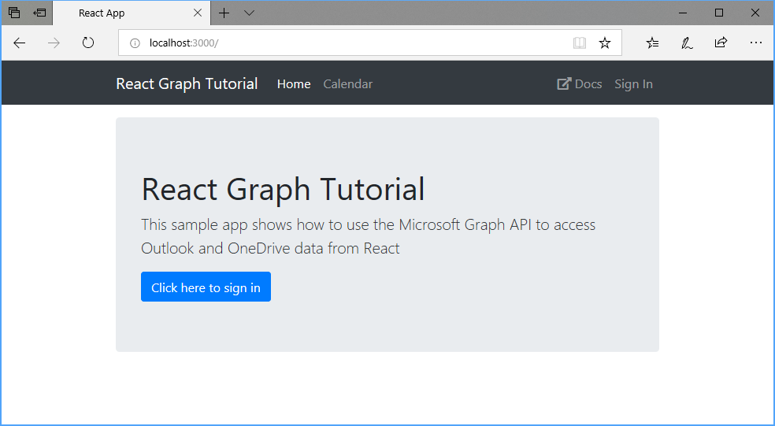

<!-- markdownlint-disable MD002 MD041 -->

En esta sección, creará una nueva aplicación reAct.

1. Abra la interfaz de línea de comandos (CLI), vaya a un directorio donde tenga derechos para crear archivos y ejecute los siguientes comandos para crear una nueva aplicación reAct.

    ```Shell
    npx create-react-app@3.4.0 graph-tutorial --template typescript
    ```

1. Una vez que finalice el comando, cambie `graph-tutorial` al directorio de la CLI y ejecute el siguiente comando para iniciar un servidor Web local.

    ```Shell
    npm start
    ```

El explorador predeterminado se abre [https://localhost:3000/](https://localhost:3000) en con una página de reAct predeterminada. Si el explorador no se abre, ábralo y vaya [https://localhost:3000/](https://localhost:3000) a para comprobar que la nueva aplicación funciona.

## <a name="add-node-packages"></a>Agregar paquetes de nodo

Antes de continuar, instale algunos paquetes adicionales que usará más adelante:

- [reAct-router-Dom](https://github.com/ReactTraining/react-router) para el enrutamiento declarativo dentro de la aplicación reAct.
- [bootstrap](https://github.com/twbs/bootstrap) para aplicar estilos y componentes comunes.
- [reactstrap](https://github.com/reactstrap/reactstrap) para los componentes de reAct basados en bootstrap.
- [fontawesome: libre](https://github.com/FortAwesome/Font-Awesome) para iconos.
- [momento](https://github.com/moment/moment) para dar formato a fechas y horas.
- [msal](https://github.com/AzureAD/microsoft-authentication-library-for-js) para autenticar en Azure Active Directory y recuperar los tokens de acceso.
- [Microsoft-Graph-Client](https://github.com/microsoftgraph/msgraph-sdk-javascript) para realizar llamadas a Microsoft Graph.

Ejecute el siguiente comando en su CLI.

```Shell
npm install react-router-dom@5.1.2 @types/react-router-dom@5.1.3 bootstrap@4.4.1 reactstrap@8.4.1 @types/reactstrap@8.4.2
npm install @fortawesome/fontawesome-free@5.12.1 moment@2.24.0 msal@1.2.1 @microsoft/microsoft-graph-client@2.0.0 @types/microsoft-graph@1.12.0
```

## <a name="design-the-app"></a>Diseñar la aplicación

Empiece por crear una barra de exploración para la aplicación.

1. Cree un nuevo archivo en el `./src` directorio denominado `NavBar.tsx` y agregue el siguiente código.

    :::code language="typescript" source="../demo/graph-tutorial/src/NavBar.tsx" id="NavBarSnippet":::

1. Cree una página principal para la aplicación. Cree un nuevo archivo en el `./src` directorio denominado `Welcome.tsx` y agregue el siguiente código.

    :::code language="typescript" source="../demo/graph-tutorial/src/Welcome.tsx" id="WelcomeSnippet":::

1. Cree un mensaje de error para mostrar mensajes al usuario. Cree un nuevo archivo en el `./src` directorio denominado `ErrorMessage.tsx` y agregue el siguiente código.

    :::code language="typescript" source="../demo/graph-tutorial/src/ErrorMessage.tsx" id="ErrorMessageSnippet":::

1. Abra el archivo `./src/index.css` y reemplace todo su contenido por lo siguiente.

    :::code language="css" source="../demo/graph-tutorial/src/index.css":::

1. Abra `./src/App.tsx` y reemplace todo el contenido por lo siguiente.

    ```typescript
    import React, { Component } from 'react';
    import { BrowserRouter as Router, Route, Redirect } from 'react-router-dom';
    import { Container } from 'reactstrap';
    import NavBar from './NavBar';
    import ErrorMessage from './ErrorMessage';
    import Welcome from './Welcome';
    import 'bootstrap/dist/css/bootstrap.css';

    class App extends Component<any> {
      render() {
        let error = null;
        if (this.props.error) {
          error = <ErrorMessage
            message={this.props.error.message}
            debug={this.props.error.debug} />;
        }

        return (
          <Router>
            <div>
              <NavBar
                isAuthenticated={this.props.isAuthenticated}
                authButtonMethod={this.props.isAuthenticated ? this.props.logout : this.props.login}
                user={this.props.user}/>
              <Container>
                {error}
                <Route exact path="/"
                  render={(props) =>
                    <Welcome {...props}
                      isAuthenticated={this.props.isAuthenticated}
                      user={this.props.user}
                      authButtonMethod={this.props.login} />
                  } />
              </Container>
            </div>
          </Router>
        );
      }
    }

    export default App;
    ```

1. Guarde todos los cambios y actualice la página. Ahora, la aplicación debe tener un aspecto muy diferente.

    
