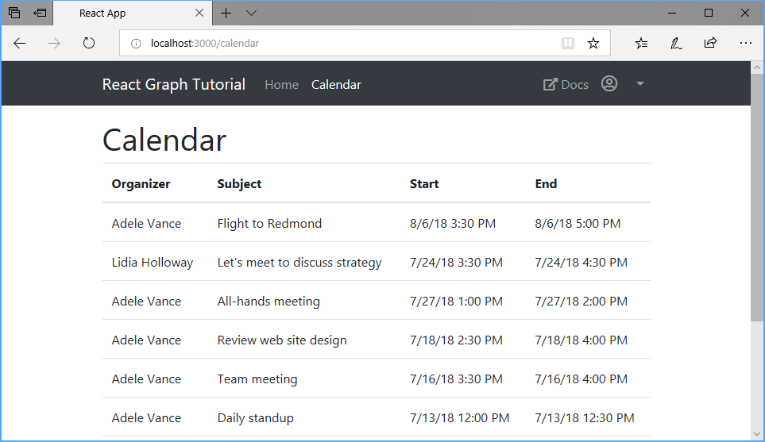

<!-- markdownlint-disable MD002 MD041 -->

<span data-ttu-id="845f5-101">En este ejercicio, incorporará Microsoft Graph a la aplicación.</span><span class="sxs-lookup"><span data-stu-id="845f5-101">In this exercise you will incorporate the Microsoft Graph into the application.</span></span> <span data-ttu-id="845f5-102">Para esta aplicación, usará la biblioteca de [Microsoft-Graph-Client](https://github.com/microsoftgraph/msgraph-sdk-javascript) para realizar llamadas a Microsoft Graph.</span><span class="sxs-lookup"><span data-stu-id="845f5-102">For this application, you will use the [microsoft-graph-client](https://github.com/microsoftgraph/msgraph-sdk-javascript) library to make calls to Microsoft Graph.</span></span>

## <a name="get-calendar-events-from-outlook"></a><span data-ttu-id="845f5-103">Obtener eventos de calendario de Outlook</span><span class="sxs-lookup"><span data-stu-id="845f5-103">Get calendar events from Outlook</span></span>

1. <span data-ttu-id="845f5-104">Abra `./src/GraphService.ts` y agregue la siguiente función.</span><span class="sxs-lookup"><span data-stu-id="845f5-104">Open `./src/GraphService.ts` and add the following function.</span></span>

    :::code language="typescript" source="../demo/graph-tutorial/src/GraphService.ts" id="getEventsSnippet":::

    <span data-ttu-id="845f5-105">Tenga en cuenta lo que está haciendo este código.</span><span class="sxs-lookup"><span data-stu-id="845f5-105">Consider what this code is doing.</span></span>

    - <span data-ttu-id="845f5-106">La dirección URL a la que se `/me/events`llamará es.</span><span class="sxs-lookup"><span data-stu-id="845f5-106">The URL that will be called is `/me/events`.</span></span>
    - <span data-ttu-id="845f5-107">El `select` método limita los campos devueltos para cada evento a solo aquellos que la vista usará realmente.</span><span class="sxs-lookup"><span data-stu-id="845f5-107">The `select` method limits the fields returned for each events to just those the view will actually use.</span></span>
    - <span data-ttu-id="845f5-108">El `orderby` método ordena los resultados por la fecha y hora en que se crearon, con el elemento más reciente en primer lugar.</span><span class="sxs-lookup"><span data-stu-id="845f5-108">The `orderby` method sorts the results by the date and time they were created, with the most recent item being first.</span></span>

1. <span data-ttu-id="845f5-109">Cree un componente de reAct para mostrar los resultados de la llamada.</span><span class="sxs-lookup"><span data-stu-id="845f5-109">Create a React component to display the results of the call.</span></span> <span data-ttu-id="845f5-110">Cree un nuevo archivo en el `./src` directorio denominado `Calendar.tsx` y agregue el siguiente código.</span><span class="sxs-lookup"><span data-stu-id="845f5-110">Create a new file in the `./src` directory named `Calendar.tsx` and add the following code.</span></span>

    ```typescript
    import React from 'react';
    import { Table } from 'reactstrap';
    import moment from 'moment';
    import { Event } from 'microsoft-graph';
    import { config } from './Config';
    import { getEvents } from './GraphService';
    import withAuthProvider, { AuthComponentProps } from './AuthProvider';

    interface CalendarState {
      events: Event[];
    }

    // Helper function to format Graph date/time
    function formatDateTime(dateTime: string | undefined) {
      if (dateTime !== undefined) {
        return moment.utc(dateTime).local().format('M/D/YY h:mm A');
      }
    }

    class Calendar extends React.Component<AuthComponentProps, CalendarState> {
      constructor(props: any) {
        super(props);

        this.state = {
          events: []
        };
      }

      async componentDidMount() {
        try {
          // Get the user's access token
          var accessToken = await this.props.getAccessToken(config.scopes);
          // Get the user's events
          var events = await getEvents(accessToken);
          // Update the array of events in state
          this.setState({events: events.value});
        }
        catch(err) {
          this.props.setError('ERROR', JSON.stringify(err));
        }
      }

      render() {
        return (
          <pre><code>{JSON.stringify(this.state.events, null, 2)}</code></pre>
        );
      }
    }

    export default withAuthProvider(Calendar);
    ```

    <span data-ttu-id="845f5-111">Por ahora, esto solo representa la matriz de eventos en JSON en la página.</span><span class="sxs-lookup"><span data-stu-id="845f5-111">For now this just renders the array of events in JSON on the page.</span></span>

1. <span data-ttu-id="845f5-112">Agregue este nuevo componente a la aplicación.</span><span class="sxs-lookup"><span data-stu-id="845f5-112">Add this new component to the app.</span></span> <span data-ttu-id="845f5-113">Abra `./src/App.tsx` y agregue la siguiente `import` instrucción a la parte superior del archivo.</span><span class="sxs-lookup"><span data-stu-id="845f5-113">Open `./src/App.tsx` and add the following `import` statement to the top of the file.</span></span>

    ```typescript
    import Calendar from './Calendar';
    ```

1. <span data-ttu-id="845f5-114">Agregue el siguiente componente justo después del existente `<Route>`.</span><span class="sxs-lookup"><span data-stu-id="845f5-114">Add the following component just after the existing `<Route>`.</span></span>

    ```typescript
    <Route exact path="/calendar"
      render={(props) =>
        this.props.isAuthenticated ?
          <Calendar {...props} /> :
          <Redirect to="/" />
      } />
    ```

1. <span data-ttu-id="845f5-115">Guarde los cambios y reinicie la aplicación.</span><span class="sxs-lookup"><span data-stu-id="845f5-115">Save your changes and restart the app.</span></span> <span data-ttu-id="845f5-116">Inicie sesión y haga clic en el vínculo de **calendario** en la barra de navegación.</span><span class="sxs-lookup"><span data-stu-id="845f5-116">Sign in and click the **Calendar** link in the nav bar.</span></span> <span data-ttu-id="845f5-117">Si todo funciona, debería ver un volcado JSON de eventos en el calendario del usuario.</span><span class="sxs-lookup"><span data-stu-id="845f5-117">If everything works, you should see a JSON dump of events on the user's calendar.</span></span>

## <a name="display-the-results"></a><span data-ttu-id="845f5-118">Mostrar los resultados</span><span class="sxs-lookup"><span data-stu-id="845f5-118">Display the results</span></span>

<span data-ttu-id="845f5-119">Ahora puede actualizar el `Calendar` componente para mostrar los eventos de forma más fácil de uso.</span><span class="sxs-lookup"><span data-stu-id="845f5-119">Now you can update the `Calendar` component to display the events in a more user-friendly manner.</span></span>

1. <span data-ttu-id="845f5-120">Reemplace la función `render` existente en `./src/Calendar.js` con la siguiente función.</span><span class="sxs-lookup"><span data-stu-id="845f5-120">Replace the existing `render` function in `./src/Calendar.js` with the following function.</span></span>

    :::code language="typescript" source="../demo/graph-tutorial/src/Calendar.tsx" id="renderSnippet":::

    <span data-ttu-id="845f5-121">Esto recorre la colección de eventos y agrega una fila de tabla para cada uno.</span><span class="sxs-lookup"><span data-stu-id="845f5-121">This loops through the collection of events and adds a table row for each one.</span></span>

1. <span data-ttu-id="845f5-122">Guarde los cambios y reinicie la aplicación.</span><span class="sxs-lookup"><span data-stu-id="845f5-122">Save the changes and restart the app.</span></span> <span data-ttu-id="845f5-123">Haga clic en el vínculo del **calendario** y la aplicación ahora debe representar una tabla de eventos.</span><span class="sxs-lookup"><span data-stu-id="845f5-123">Click on the **Calendar** link and the app should now render a table of events.</span></span>

    
